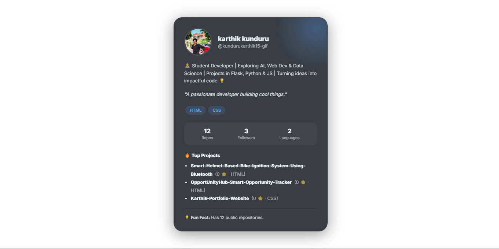
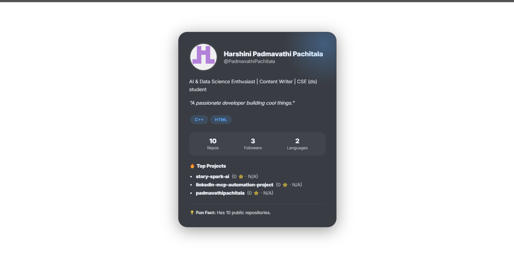
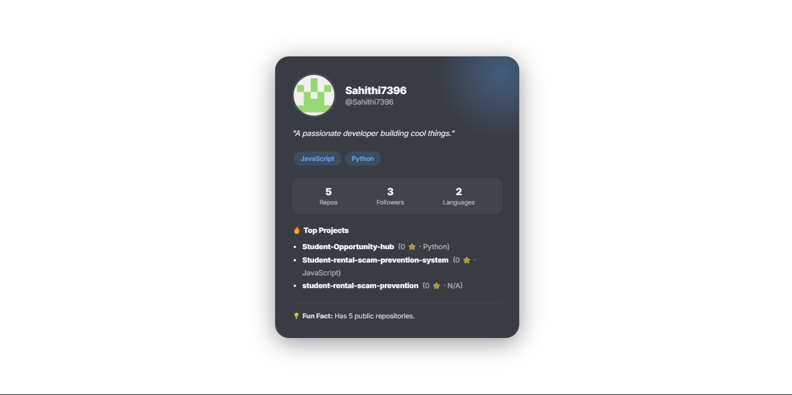

# GitHub Dev Card Generator

Generate beautiful, AI-powered developer identity cards from any public GitHub profile.



## What it does

Enter a GitHub username → the app fetches the profile via the GitHub API, sends it to **Gemini 2.0 Flash** for analysis, and renders a styled dev card with:

- Avatar, name, bio, and location
- AI-generated developer vibe & fun fact
- Top skills and most-used languages
- Top 3 starred repositories
- Stats: repos, followers, languages

Cards can be downloaded as **PNG**, exported as **PDF**, or shared via a **QR code**.

## Themes

| Theme | Preview |
|-------|---------|
| 🌑 Dark | GitHub-inspired dark |
| ☀️ Light | Clean light mode |
| ⚡ Neon | Cyberpunk green glow |

## Tech Stack

| Layer | Tech |
|-------|------|
| Frontend | Vanilla HTML/CSS/JS |
| Backend | FastAPI (Python) |
| AI | Google Gemini 2.0 Flash |
| Data | GitHub REST API |
| Export | html2canvas, jsPDF |
| Infra | Docker + Docker Compose |

## Getting Started

### Prerequisites

- Docker & Docker Compose
- A [Google Gemini API key](https://aistudio.google.com/app/apikey)
- (Optional) A GitHub personal access token for higher rate limits

### Setup

1. Clone the repo:
   ```bash
   git clone https://github.com/<your-username>/github-dev-card-generator.git
   cd github-dev-card-generator/github-card-generator
   ```

2. Create your `.env` file:
   ```bash
   cp .env.example .env
   ```

3. Fill in your credentials in `.env`:
   ```env
   GOOGLE_API_KEY=<your_gemini_api_key>
   GITHUB_TOKEN=<your_github_token>   # optional
   ```

4. Start the app:
   ```bash
   docker-compose up --build
   ```

5. Open [http://localhost:8080](http://localhost:5000) in your browser.

### Running without Docker

```bash
cd backend
pip install -r requirements.txt
uvicorn main:app --host 0.0.0.0 --port 8080
```

Then open `frontend/index.html` directly in your browser.

## API Reference

| Method | Endpoint | Description |
|--------|----------|-------------|
| `GET` | `/health` | Health check |
| `POST` | `/generate` | Generate a dev card |
| `GET` | `/card/{username}` | Retrieve a saved card |

### POST `/generate`

```json
{
  "username": "torvalds",
  "theme": "dark"
}
```

Response includes `card_url`, `vibe`, and `theme`.

## Project Structure

```
github-card-generator/
├── backend/
│   ├── main.py          # FastAPI app & routes
│   ├── agent.py         # Orchestration logic
│   ├── mcp_server.py    # GitHub scraping, Gemini AI, HTML generation
│   ├── requirements.txt
│   └── Dockerfile
├── frontend/
│   ├── index.html       # Single-page UI
│   └── Dockerfile
└── docker-compose.yml
```

## Screenshots

| | | |
|---|---|---|
|  |  |  |

## License

MIT
